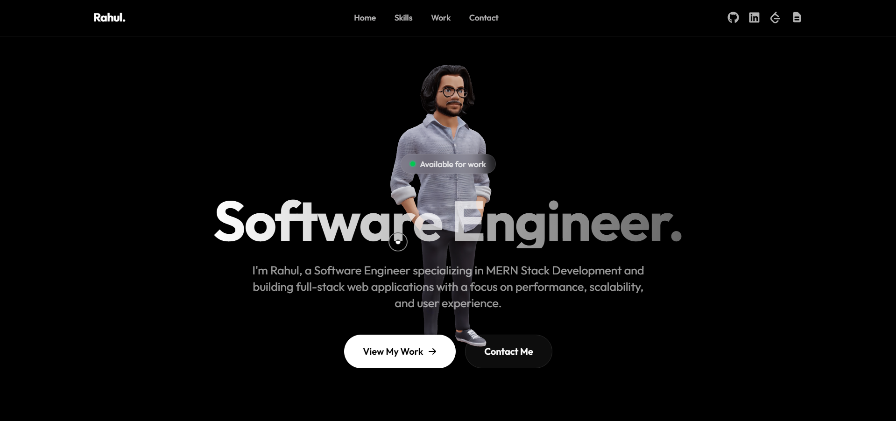

**Hey there!**

Welcome to my personal portfolio website! This project showcases my journey as a Full Stack Developer, featuring my projects, skills, and achievements. It's built with modern web technologies to deliver a smooth, immersive, and responsive user experience.



## 🛠️ Tech Stack

- **Framework:** [Next.js](https://nextjs.org/)
- **Language:** [TypeScript](https://www.typescriptlang.org/)
- **Styling:** [Tailwind CSS](https://tailwindcss.com/)
- **Animations:** [Framer Motion](https://www.framer.com/motion/), [Three.js](https://threejs.org/)
- **Deployment:** [Vercel](https://vercel.com/)

## 🚀 Getting Started

Follow these steps to run the project locally on your machine.

### Prerequisites

- Node.js (v18 or higher)
- npm, yarn, or pnpm

### Installation

1. **Clone the repository:**

    ```bash
    git clone https://github.com/Rahul-R79/Me-Portfolio.git
    cd Me-Portfolio
    ```

2. **Install dependencies:**

    ```bash
    npm install
    # or
    yarn install
    ```

3. **Run the development server:**

    ```bash
    npm run dev
    ```

4. **Open your browser:**
   Navigate to [http://localhost:3000](http://localhost:3000) to see the app running.

## 🤝 Contact

I'm always open to discussing new projects, creative ideas, or opportunities to be part of your visions.

- **LinkedIn:** [Rahul R](https://www.linkedin.com/in/rahulqwe)
- **Email:** rahul.devworks@gmail.com

---

Built with ❤️ by Rahul.
